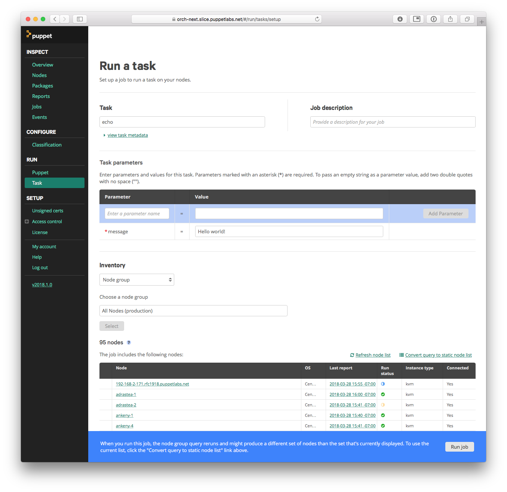
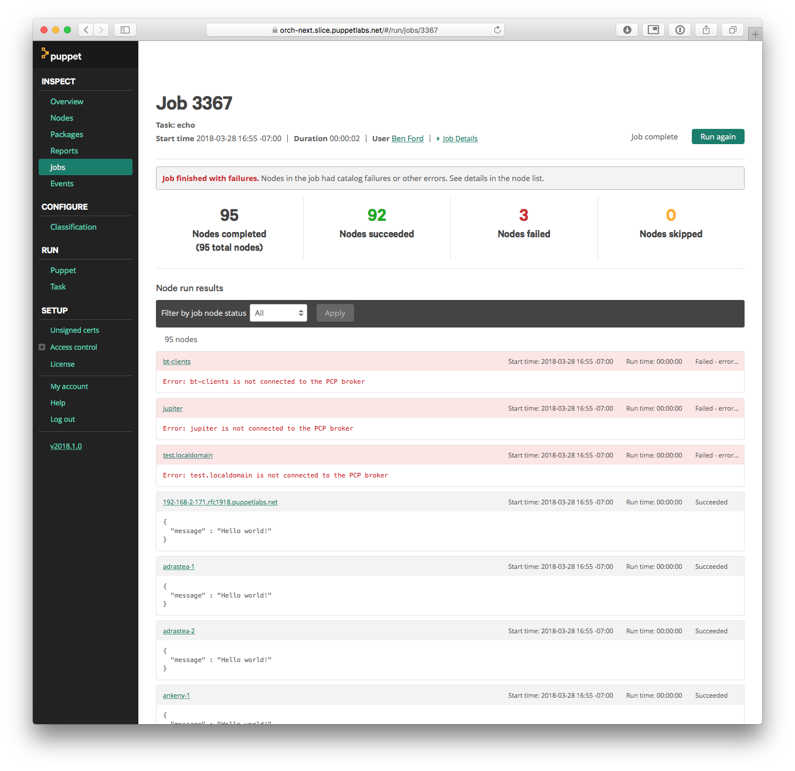
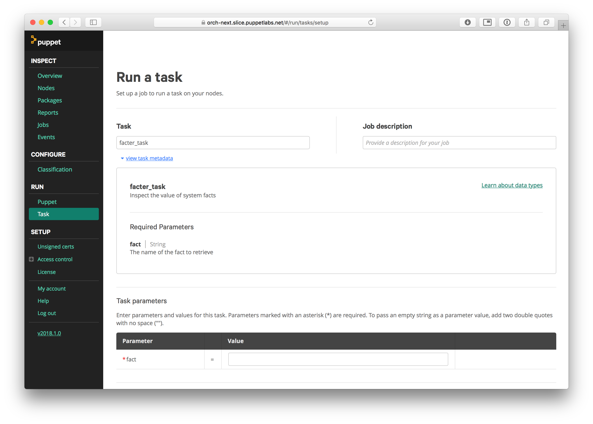
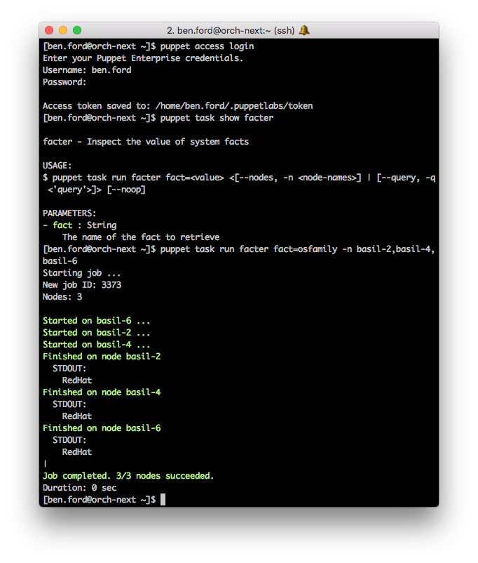
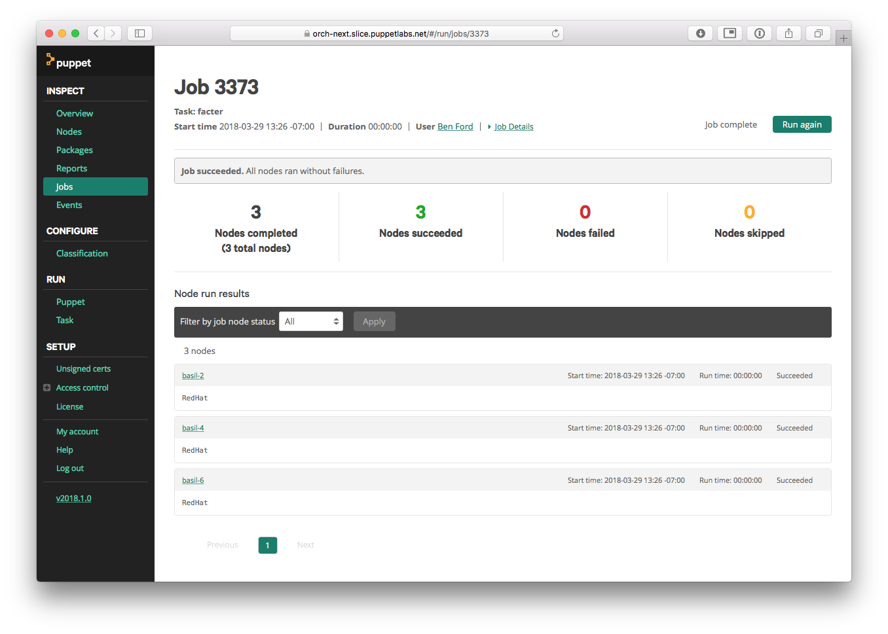
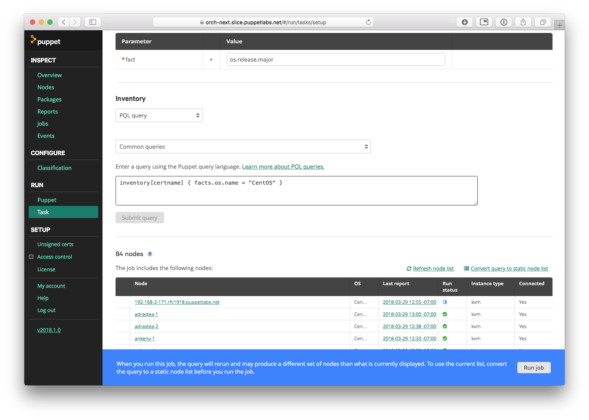

# Introduction to Puppet Orchestration and Tasks

Puppet Tasks are a way to solve problems that don't fit well into Puppet's
traditional declarative configuration management model.

As we know, Puppet is great at modeling resources and then enforcing state over
time. It will check the state of a resource, fix it if it's wrong, and send a
report back to the Puppet Master if it changed anything. But sometimes you don't need to model the state of a resource--you need to orchestrate
"point-in-time" changes. Instead of long-term configuration management, you
need to make something happen and be done with it. Puppet Tasks are a simple
and quick way to immediately upgrade packages, restart services, or perform any
other type of single-action executions on your nodes.

The Puppet Orchestrator uses your existing Puppet Enterprise infrastructure to
run tasks everywhere you need them. This allows you to scale up to global
networks of thousands of nodes with hardly any configuration to start with. If
you don't have your target nodes Puppetized yet, you can also run tasks via SSH
or WinRM covered in the open source [Bolt documentation](https://puppet.com/docs/bolt/latest/bolt.html).

If you are a Puppet Enterprise user, you can follow along with this tutorial and run the commands shown in the examples. You can also choose to review this material firstand then move to a hands-on lab for practice. 

<i class="fa fa-graduation-cap" aria-hidden="true"></i> 
### Lesson 
Let's get started and run a task across our entire infrastructure. We'll use a task that shows the version of the `openssl` package.

In the *Tasks* tab of the PE Console, type in the name of the task,
`package`. Notice how a list appears and filters down as you type the word.
After selecting the `package` task, the `Task Parameters` interface updates with the parameters accepted by the task. In this case, there are two parameters - `action` and `name`.

Since we want to interrogate all of the servers in the infrastructure for the version of OpenSSL they are running, we'll select `status` for the `action` parameter and enter `openssl` for the `name` parameter.

<<SCREENSHOT OF TASK AND TASK PARAMETERS>>

The job runs on each node selected, and any output will be displayed.
You'll see any nodes that failed on the top of the list. In this example, seven
nodes weren't connected to the broker. Perhaps they were in the middle of
restarting. We can use this list to further investigate offline, if needed.

<<NEW SCREENSHOT OF COMPLETED JOB>>

Now that we've run our first task, how do you know how to use this task? Let's
use the PE Console to find out. We'll go back to that top-level **Tasks** tab.
Instead of typing a name this time, click in that text box and wait a moment.
All of the installed tasks will show up in the drop-down, and you can scroll
through to see what tasks you can run.

Pick one out by either clicking its name or typing it out. Directly underneath
you'll see a **view task metadata** disclosure triangle. Expand it, and you'll find a quick description of the task and all of its parameters.

On the other hand, maybe you don't want to click through the graphical interface
to run tasks. Or maybe you'd like to invoke tasks as part of a script or a cron
job. There is a way to do it without using the GUI.

First make sure that [PE Client Tools](https://puppet.com/docs/pe/latest/installing/installing_pe_client_tools.html)
have valid tokens to access the API. You want to see the usage instructions of the task you want to run, so first ask
the Orchestrator. Note that if you don't specify the name of a task, it will list
all of the installed tasks. In this case, I'll use `facter` as my example.

    $ puppet task show facter
    
    facter - Inspect the value of system facts
    
    USAGE:
    $ puppet task run facter fact=<value> <[--nodes, -n <node-names>] | [--query, -q <'query'>]> [--noop]
    
    PARAMETERS:
    - fact : String
        The name of the fact to retrieve
      
Then to run a task, specify the task, its parameters, and a list of nodes
to run the task on. The tasks are all run at the same time, and they're not run
sequentially. You'll see information coming back from each node as soon as the
Orchestrator knows about it.

    $ puppet task run facter fact=osfamily -n basil-2,basil-4,basil-6
    Starting job ...
    New job ID: 3373
    Nodes: 3
    
    Started on basil-6 ...
    Started on basil-2 ...
    Started on basil-4 ...
    Finished on node basil-2
      STDOUT:
        RedHat
    Finished on node basil-4
      STDOUT:
        RedHat
    Finished on node basil-6
      STDOUT:
        RedHat
    |
    Job completed. 3/3 nodes succeeded.
    Duration: 0 sec
    
If you'd like to see those results again, you can use the `puppet job show`
command. Specify the same job ID as the `puppet task run` command displayed.

    $ puppet job show 3373
    Status:       finished
    Job type:     task
    Start time:   03/29/2018 08:26:07 PM
    Finish time:  03/29/2018 08:26:07 PM
    Duration:     0 sec
    User:         ben.ford
    Environment:  production
    Nodes:        3
    
    Task name: facter
    Task parameters:
      fact : osfamily
    
    SUCCEEDED (3/3)
    --------------------------------------------------------------------------
    basil-6
        STDOUT:
          RedHat
    basil-4
        STDOUT:
          RedHat
    basil-2
        STDOUT:
          RedHat
          
You can also return to the PE Console and see the same information under the
**Jobs** tab. Just choose the Job ID from the list, and you'll see the report.

If you had to type out the name of each node you wanted to run on,
this would be a rather tedious tool to use, especially if you have a large
infrastructure. An easier way to operate is by filtering your inventory. Let's
see what that might look like by running the `facter` task to find the major
release version of all our CentOS machines.

For this example, I specify that I want the `os.release.major` fact from all the nodes
who match the [PQL](https://puppet.com/docs/puppetdb/latest/api/query/v4/pql.html)
query `inventory[certname] { facts.os.name = "CentOS" }`. The PE Console provides
a list of common queries ready to customize, so most of the time you can
choose a query from the list and then update a parameter.

You could also run that from the command line. A simple workflow to get started
might be to generate and preview the desired PQL query in the PE Console
and then copy/paste it into your script.

    $ puppet task run facter fact=os.release.major --query 'inventory[certname] { facts.os.name = "CentOS" }'
    Starting job ...
    New job ID: 3379
    Nodes: 84
    
    Started on thebe-3 ...
    Started on bronze-10 ...
    Started on enceladus-1 ...
    [...]
    Finished on node ankeny-4
      STDOUT:
        7
    Finished on node rosemary-6
      STDOUT:
        7
    Finished on node bronze-2
      STDOUT:
        7
    
    Job failed. 3 nodes failed, 0 nodes skipped, 81 nodes succeeded.
    Duration: 0 sec
    
#### Writing tasks
The true power of Puppet Tasks comes when you learn how to write your
own. Tasks are very similar to simple scripts, written in any language you like.
To turn a shell script into a task, you put it in a `tasks` directory of any
Puppet module and write a metadata file that describes how it works. This allows
you to reuse and share tasks.

Let's start with a simple shell script that calculates how
many packages are installed on a RedHat family system.

    #! /bin/bash
    # We need to drop the first line, since it's a header
    expr $(yum list installed --quiet | wc -l) - 1
    
To make this into a task, we create a Puppet module and put this file into
the module's `tasks` directory along with a `.json` file with the same name.

    $ tree packages/
    packages/
    └── tasks
        ├── yum.json
        └── yum.sh
    
The `yum.json` file describes how to interact with the task. The minimum
useful file might look like the following, but you can describe parameters, data
types, enable noop mode, etc. The [Writing Tasks](https://puppet.com/docs/bolt/0.x/writing_tasks.html)
docs page has more information.

    $ cat tasks/yum.json
    {
      "description": "Returns the number of yum packages installed"
    }

As soon as the module is installed on the Puppet master, you can run it just
like any other task and get back the information you requested. Note that the
name of the task is `{module name}::{script name}`

    $ puppet task run packages::yum --query 'inventory[certname] { facts.os.name = "CentOS" }'
    Starting job ...
    New job ID: 3380
    Nodes: 84
    
    Started on beryllium-4 ...
    Started on daisy-8 ...
    Started on titan-10 ...
    [...]
    Finished on node titan-2
      STDOUT:
        557
    Finished on node thyme-8
      STDOUT:
        632
    Finished on node adrastea-2
      STDOUT:
        523
    
    Job failed. 3 nodes failed, 0 nodes skipped, 81 nodes succeeded.
    Duration: 0 sec

The Puppet Orchestrator handles distributing the task everywhere it needs to
be, executing it, and returning the results. Because these scripts will be
run on multiple nodes and might take untrusted input specified by system
administrators, you should ensure that you write your scripts to handle untrusted
data in a safe manner. See the [Writing Tasks](https://puppet.com/docs/bolt/0.x/writing_tasks.html) docs page for some guidelines on writing secure code.

<i class="fa fa-pencil" aria-hidden="true"></i>
### Use Cases
You might be tempted to sit down and smash out tasks 
to perform all your maintenance and configuration tasks. Before you do this, take a moment
to consider long-term maintainability. In many cases, taking the time to update
shell script methodologies might serve your purposes better.

Jobs that are simple one-time actions or that must be orchestrated across
multiple nodes in the correct sequence are great candidates for Puppet Tasks.
For example, you might want a task to restart your webserver or clear the
mailserver outgoing message queue. These are not well suited for Puppet because
they're a one-time action, but they'd make great tasks. On the other hand, the
job of making sure that the node is running the latest version of Apache or
Postfix is a long term configuration management job and pushing it out via tasks
would not gain you the benefits and peace of mind that managing the resources
with Puppet would.

<i class="fa fa-desktop" aria-hidden="true"></i>
### Practice
Visit the [Hands on Lab](https://github.com/puppetlabs/tasks-hands-on-lab).
to practice your skills. This covers the full Bolt ecosystem, which is the open source task runner
subsystem of Puppet Orchestration. Bolt uses SSH and WinRM as transport
mechanisms, while Puppet Orchestration uses your existing Puppet infrastructure.
For the most part, where the Hands on Lab instructs you to run `bolt task`, you
can also run `puppet task` to accomplish the same results. The tutorial also
covers writing Puppet plans, which are scripts that can programmatically
aggregate multiple tasks in sequence, or make conditional runtime decisions about
them.

We hope you enjoyed this session and are just as excited about running tasks in
Puppet Enterprise as we are.
